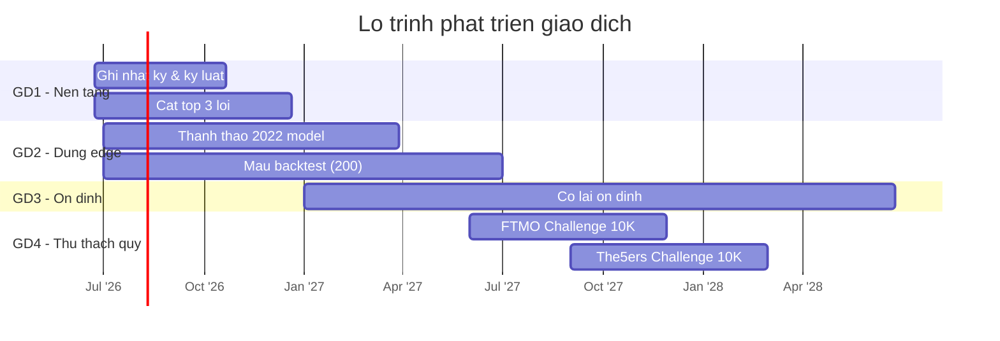

# 🗺️ Lộ Trình Giao Dịch

> Bức tranh tổng thể. Mỗi **giai đoạn (phase)** là một chương phát triển; các mục tiêu được gắn vào giai đoạn qua field `phase:`. Các giai đoạn diễn ra tuần tự nhưng có thể chồng lấn.

## Các giai đoạn tổng quan

| Giai đoạn                   | Chủ đề                 | Kỳ hạn             | Trọng tâm                                                                             |
| --------------------------- | ---------------------- | ------------------ | ------------------------------------------------------------------------------------- |
| **Giai đoạn 1 – Nền tảng**  | Kỷ luật & dữ liệu sạch | Ngắn (3–6 tháng)   | Ghi nhật ký hàng ngày, diệt lỗi top, theo checklist                                   |
| **Giai đoạn 2 – Dựng edge** | Xác thực edge          | Trung (6–12 tháng) | Thành thạo 2022 model, tăng mẫu backtest, định nghĩa playbook                         |
| **Giai đoạn 3 – Ổn định**   | Nhân edge lên          | Dài (1–3 năm)      | Tháng có lãi, kiểm soát drawdown, thực thi máy móc                                    |
| **Giai đoạn 4 - Thử thách** | Thi Quỹ cấp vốn        | Dài (1.5-2 năm)    | Mục tiêu: <br>- Pass package 10K$ của quỹ FTMO<br>- Pass package 10k$ của quỹ The5ers |

## Giai đoạn 1 — Nền tảng  ·  ~6 tháng tới
**Mục tiêu:** Làm cho quy trình và dữ liệu đáng tin. Edge không có ý nghĩa nếu đầu vào nhiễu.

- Ghi nhật ký mỗi ngày giao dịch, hoàn thành checklist trước lệnh cho mọi lệnh.
- Xác định và cắt giảm 3 lỗi hay lặp lại nhất.
- Thiết lập nhịp backtest hàng tuần đều đặn.

```dataview
TABLE horizon AS "Kỳ hạn", status AS "Trạng thái", progress + "%" AS "Tiến độ", due_date AS "Hạn"
FROM "09 - Goal Tracking/Goals"
WHERE type = "goal" AND contains(phase, "Phase 1")
SORT priority DESC
```

## Giai đoạn 2 — Dựng edge  ·  ~6–12 tháng
**Mục tiêu:** Biến "mình nghĩ nó chạy được" thành edge đo được với đủ mẫu để tin tưởng.

- 100 setup 2022-model có ghi chép kèm win rate xác thực.
- 200 backtest được log với các trường nhất quán.
- Playbook rõ ràng, không mơ hồ cho từng setup.

```dataview
TABLE horizon AS "Kỳ hạn", status AS "Trạng thái", progress + "%" AS "Tiến độ", due_date AS "Hạn"
FROM "09 - Goal Tracking/Goals"
WHERE type = "goal" AND contains(phase, "Phase 2")
SORT priority DESC
```

## Giai đoạn 3 — Ổn định  ·  1–3 năm
**Mục tiêu:** Thực thi edge đã được kiểm chứng một cách máy móc và nhân nó lên qua các tháng.

- 6 tháng có lãi liên tiếp theo tổng R.
- Drawdown tối đa dưới 10R trong mọi quý cuốn chiếu.
- Tuân thủ playbook trên 90%.

```dataview
TABLE horizon AS "Kỳ hạn", status AS "Trạng thái", progress + "%" AS "Tiến độ", due_date AS "Hạn"
FROM "09 - Goal Tracking/Goals"
WHERE type = "goal" AND contains(phase, "Phase 3")
SORT priority DESC
```

## Giai đoạn 4 — Thử thách quỹ cấp vốn  ·  1.5–2 năm
**Mục tiêu:** Chứng minh edge sống được dưới luật quỹ cấp vốn và nhận tài khoản funded thật.

- Pass FTMO 2-Step Challenge 10K$ (Phase 1 +10% → Phase 2 +5%).
- Pass The5ers High Stakes 2-Step 10K$ (Phase 1 +10% → Phase 2 +5%).
- Tuyệt đối không vi phạm luật daily loss / max loss của hai quỹ.

```dataview
TABLE horizon AS "Kỳ hạn", status AS "Trạng thái", progress + "%" AS "Tiến độ", due_date AS "Hạn"
FROM "09 - Goal Tracking/Goals"
WHERE type = "goal" AND contains(phase, "Phase 4")
SORT priority DESC
```

## Dòng thời gian (trực quan)



## Liên kết
- Dashboard: [[00 - Goal Dashboard]]
- Chỉ số: [[02 - Skill Metrics]]
